# Washington, DC Crime Analysis & Predictive Modeling

### Project Overview
The intent for this project is two-fold: 

- **Part One** - Involves exploratory data analysis of crime incidents throughout Washington, DC from July 2018 - 2019. The analysis will involve mappings of crime incidents within the city, crime volumes by certain time and day parameters, as well as crime incidents by geographical dimensions, i.e., DC Wards. 

- **Part Two** - Involves the classifying the type of crime that takes place given a number of feature variables. The DC Police Department recognizes instances of crime as one of the following classes:
     - Arson
     - Assault with A Dangerous Weapon
     - Burglary
     - Homicide
     - Motor Vehicle Theft
     - Robbery
     - Sex Abuse
     - Theft From Automobiles
     - Theft (Other)

The modeling portion will focus on identifying the best algorithm to classify the type of crime that took place. The problem we're trying to solve is whether or not a model can predict the type of crime with a reasonable accuracy score with the data provided by the DC police department. The implications of a successful model could feasibly assist the police department with allocating the appropriate resources as soon as as soon as a crime is to occur to reduce the

For both parts, we'll walk through the methods used for obtaining, cleaning, analyzing, conditioning, feature engineering, and modeling the data.

***
***
## Obtaining the Data

The crime data for this project was obtained through the Open Data DC platform maintained by the DC government: https://opendata.dc.gov. The particular dataset used is available for download via the following URL: https://opendata.dc.gov/datasets/crime-incidents-in-2019. 

Crime data was extracted for both 2018 and 2019. Both raw datasets can be found in the project repository titled: 'Crime_Incidents_in_2018.csv' & 'Crime_Incidents_in_2019.csv'.

***
***
## Data Cleaning
*The data cleaning steps are outlined in the accompanying jupyter notebook titled 'Capstone_EDA'.*

The data cleaning process was fairly straight forward as the datasets themselves are well kept. The 2018 dataset contained 33782 crime instances, while the 2019 dataset at the time of download contained 20620 crime instances.

The image below highlights the features contained within the crime datasets:

**Data Cleaning Highlights:**

- Features Removed: 
    - X', 'Y', 'CCN', 'BLOCK', 'XBLOCK', 'YBLOCK', 'ANC', 'PSA', BID', 'START_DATE', 'END_DATE'
- Features Split for Modeling Purposes (split by delimiters into individual features, i.e., 'DATE' --> 'DAY, 'MONTH, 'YEAR'): 
    - 'DATE', 'TIME'
- Features Added: 
    - 'COUNT' (for summing crime events), 'CITY' (for mapping purposes)
- Null Values Removed: 
    - The remaining dataset contained null values within some of the feature variables. The percentage of null values compared to the total dataset length was assessed and deemed insignificant enough to to remove these rows altogether: 
   - 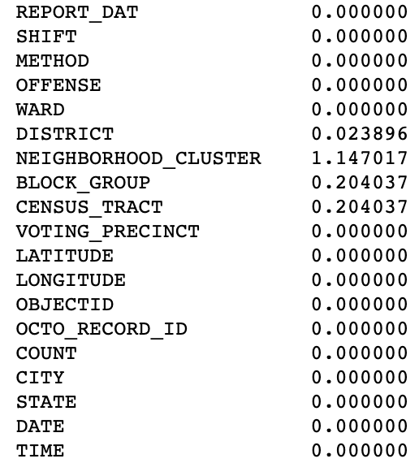
***
***
## Exploratory Data Analysis

The exploratory phase focused on two key themes: DC crime by geographical location, and crime by date and time parameters. Additionally, we took a look at the overall breakdown of total crimes committed by crime type. 

### Total Crime by Offense
To start, we offer a visualization that accounts for total crime by type: 

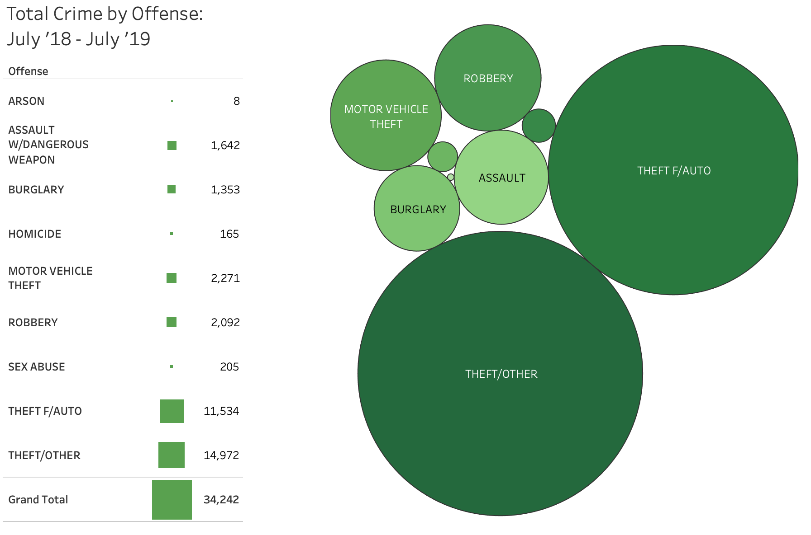

### Month, Weekday, Hour Analysis
In this section, we extract total crime volumes by the month, weekday, and hour to assess any patterns based of time dimensions:

**Total Crime Incidents by Month**

Here, we visualize total crime incidents in DC by month to extract any seasonality among crime volumes: 

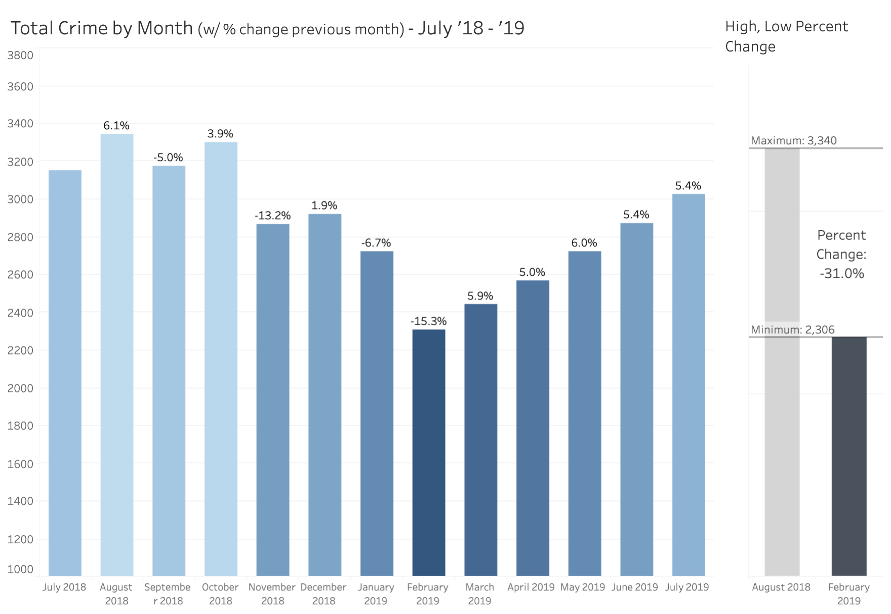

Based on the analysis, there is fairly significant seasonality with respect to total crime in DC. The delta between the months of August (peak) and February (bottom) of ~31%. A portion of this spread can be explained by the number of days in each month, however, accounting for that effect still produces a significant delta. 

**Total Crime Incidents by Weekday**

We visualized the total crime incidents by weekday to extract the effect, if any, of the weekday on the propensity for a crime to occur:

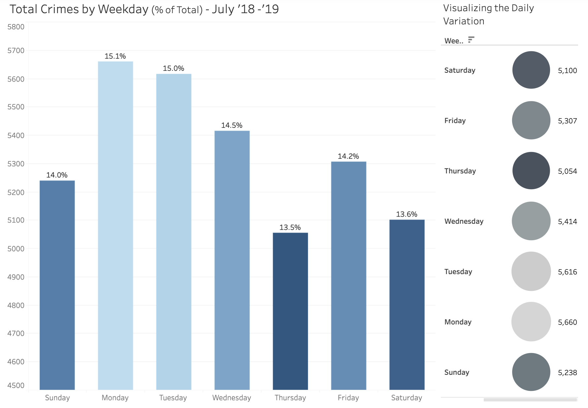

From the analysis, it appears crime volumes do not vary by weekday in a significant way. 

**Total Crime Incidents by Hour**

Our next visualizations parses the total volume of crime by hour. The goal is to highlight trends that exist in terms of crime volumes within a 24 hour cycle:

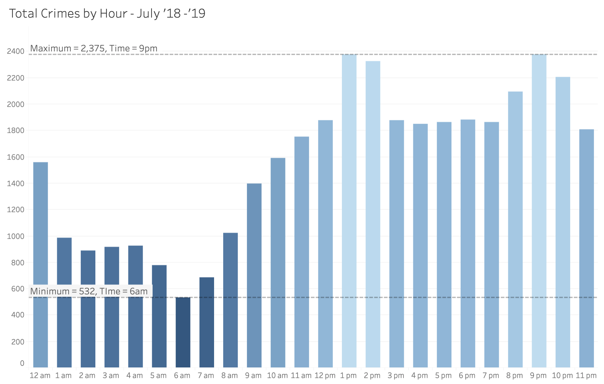

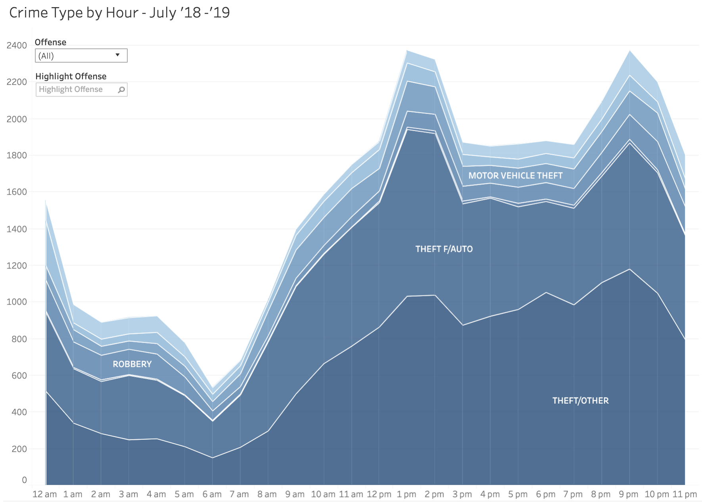

The cyclical nature of crime volumes in DC throughout a 24 hour period are clearly indicated by the graphics above.

### Geographic Analysis

This section focused on visualizing crime incidents based upon geographic location. We start with a heatmap showcasing the areas within the city where crime most frequent: 

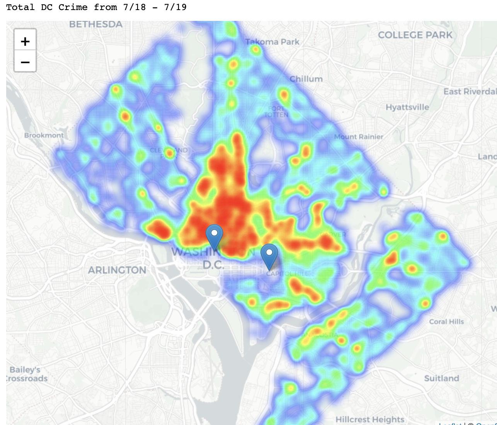

Further, we visualized crime on a 12 month animation beginning with August 2018:

*insert dc crime gif*

**Crime by Ward**

Further analysis was done to compare and contrast crime volumes by DC wards. A map of the DC ward is provided as a reference: 

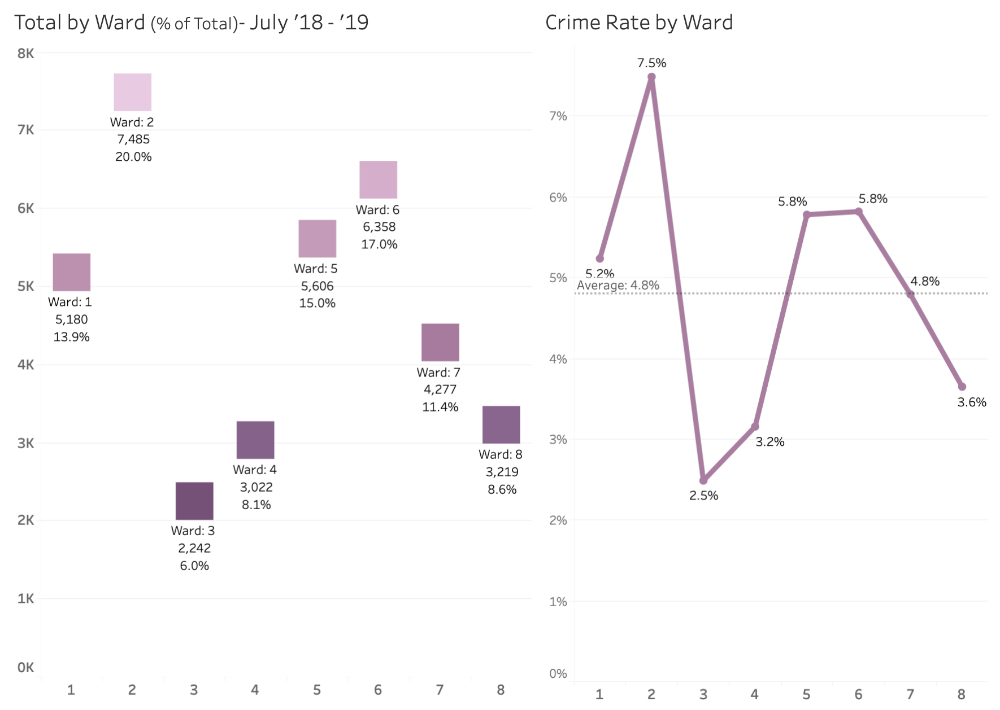

We visualized all incidents of crime separated by crime to further conceptualize the distribution of wards in DC:

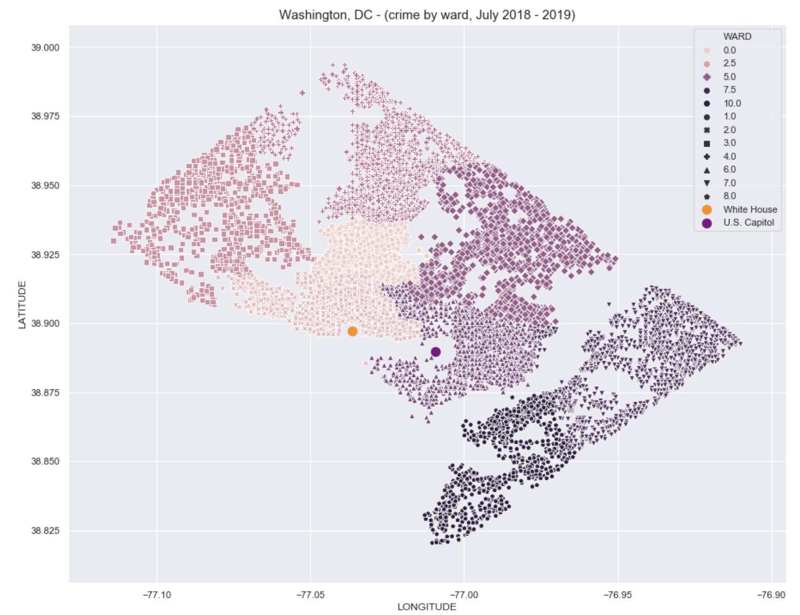

**Crime by Type**

***
***
## Modeling

The modeling portion of the project includes a number of extra steps taken to further prepare the data running through our the algorithms. The highlights are included in the sections below. Following the data processing, we'll outline the results of our final model. 

### Conditioning

Further steps were necessary to condition the data for modeling. The key steps are included: 

- Split the features 'NEIGHBORHOOD_CLUSTER' and 'VOTING_PRECINCT' from their string counterparts within each instance. Once complete, we removed the string components leaving just the numeric values for the features. The below image highlights the features addressed in this step: 
    - 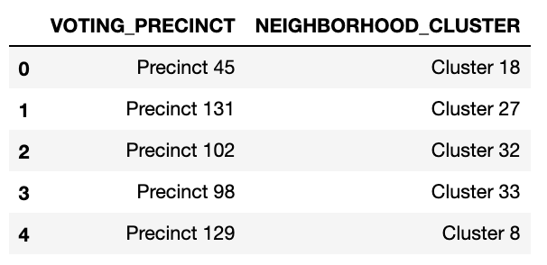
- Removed empty spaces from the 'BLOCK_GROUP' feature. 
- Converted all features assigned the wrong data type to integer or float data types. 

### Feature Engineering

Feature engineering was required to further prepare the data for modeling. The steps are included below: 

- The 'DATE' and 'TIME' features were split into their component parts - see below:
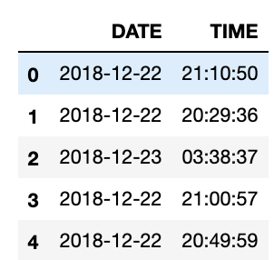
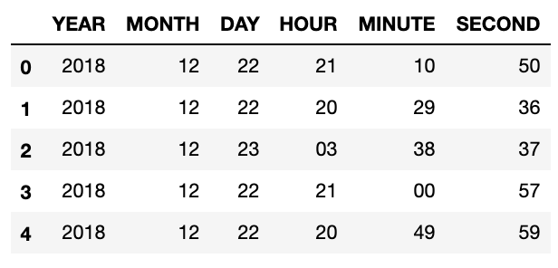
    
- Features 'SHIFT' and 'METHOD' were categorical variables which required dummification via one-hot-encoding:
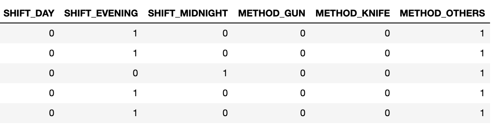
    
- Data rebalancing via the SKlearn method SMOTE was necessary due to class imabalance:
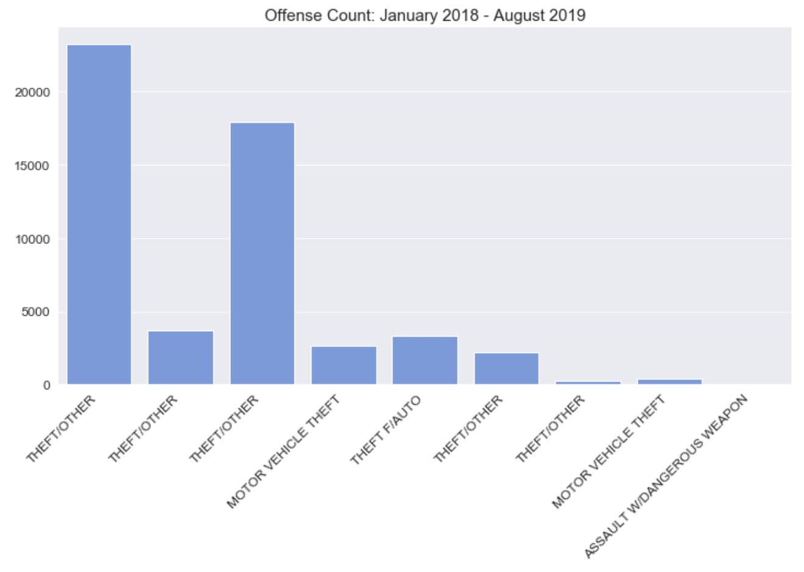
    
- Rescaling the feature variables was the final engineering step. Doing so ensures no single feature has an outsized impact on model performances:
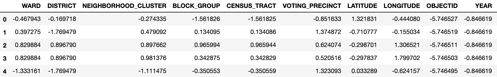

### Model Selection

With our data conditioned, features engineered for modeling and our class labels encoded, the data was ready for modeling. 

**Model Comparison**

We began the modeling portion by instantiating the following classifiers for side by side performance evaluation using each model's default hyperparameters: 

- K Nearest Neighbors
- Decision Trees
- Naive Bayes
- Random Forests
- Ada Boost

The models were run using a training set containing ~167k instances from our rebalanced dataset. The dataset was split 20 times using Kfold and assessed against the labels set using the scoring metric 'Accuracy'. We then plotted the mean and standard deviation of the 20 training instances cv scores. Below we include the output for this model comparison: 

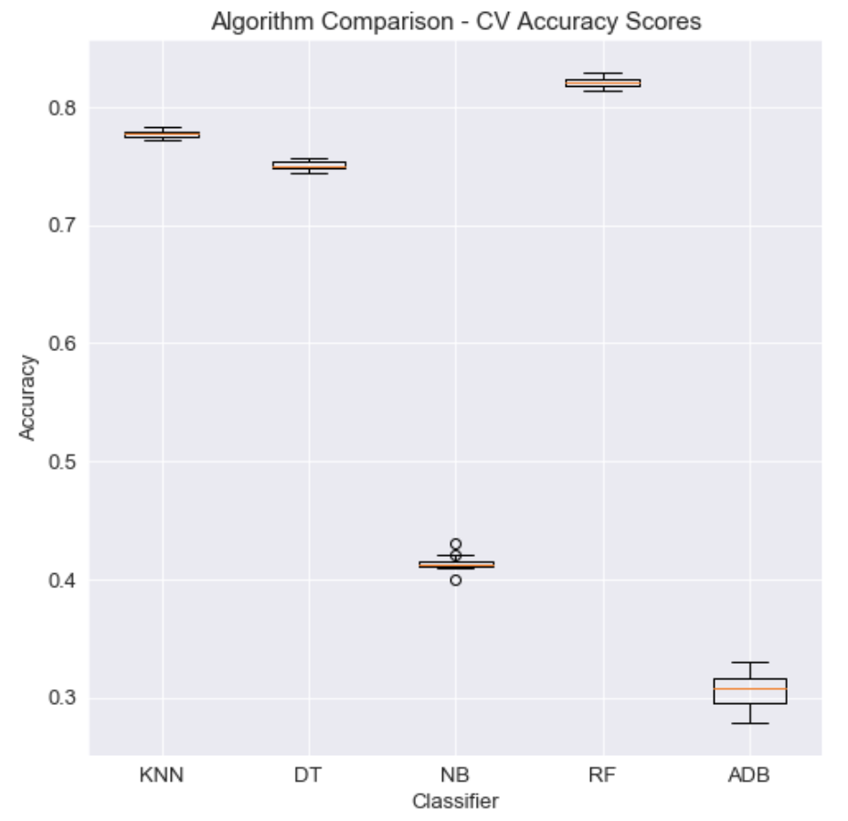

With the resulting model performances above, I chose to proceed using the Random Forest classifier as it's average accuracy performance was the highest as ~82%. 

The next step was to improve the existing Random Forest model by running SKlearn's GridSearchCV on a number of test input hyperparameters. By doing so, we extracted the best hyperparameters which resulted in an imporved accuracy performance to ~86%.

The next step was to improve the existing Random Forest model by running SKlearn's GridSearchCV on a number of test input hyperparameters. By doing so, we extracted the best hyperparameters which resulted in an imporved accuracy performance to ~86%.

As a final measure before running our final model, I decided to remove the 'SECOND' and 'MINUTE' features as such granular data regarding the exact timing of a crime is likely prone to error or human influence. The resulting feature set included 19 dimensions. 

### Final Model Evaluation

With the optimal hyperparameters extracted, and the removal of the 'MINUTE' and 'SECOND' features, our final model was run producing an accuracy score of ~85%. 

**Confusion Matrix**

We assessed the confusion matrix to visualize the model's misclassification:

**Feature Importance**

Further, we assessed the which dimensions within our dataset contribute the most predictive information for classifying crime incidents: 

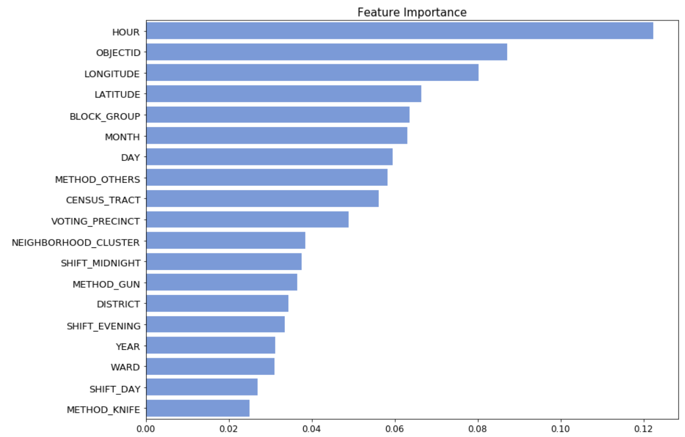

